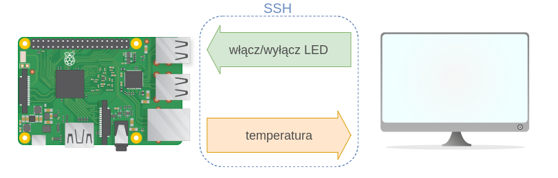
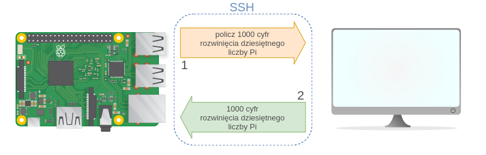

# prezentacja-ssh-stdio


+++



+++



+++

#### Python: dict (słownik)

```python
d = {
    'category': 'A+',
}

d['category'] = 'A'
d.update({'eres': False})

# Otrzymamy d = 
{
    'category': 'A',
    'eres': False
}
```

+++

#### Serializacja danych: problem

* chcemy wysłać `dict`, zakładamy że bezośrednio możemy wysłać tylko `str`

* chcemy odebrać `dict`, zakładamy że bezpośrednio odbieramy `str` 

+++

#### Serializacja danych: przykładowe rozwiązanie

* przed wysłaniem serializujemy `dict` do `str` używając `str()`

* po odebraniu deserializujemy `str` do `dict` używając `ast.literal_eval()`

+++

```text
ssh_com_rpi_demo
├── __init__.py
├── controller
│   ├── __init__.py
│   ├── pc.py
│   └── rpi.py
├── processing
│   ├── __init__.py
│   ├── pc.py
│   └── rpi.py
└── utilities.py
```

+++

```text
ssh_com_rpi_demo
├── __init__.py
├── controller
│   ├── __init__.py
│   ├── pc.py
│   └── rpi.py      <---
├── processing
│   ├── __init__.py
│   ├── pc.py
│   └── rpi.py
└── utilities.py
```

+++?code=assets/code/ssh_com_rpi_demo/controller/rpi.py&lang=python

@[1](literal_eval: str -> dict)
@[2](stdin: standardowe wejście)
@[3](Thread: wątek)

@[8](Klasa RPi)

@[56-63](Przykładowe wywołanie metody \_\_init\_\_)
@[9](Metoda \_\_init\_\_)
@[11-12](Przypisanie wartości polom)
@[14](Ustawienie stanu diód na wyłączone)
@[16-18](Konfiguracja GPIO)
@[20-30](Utworzenie wątków)

@[32](Metoda _process_input)
@[33](Wczytuj dane z stdin linia po linii)
@[34](Stwórz słownik na podstawie otrzymanej linii)
@[36-39](Jeśli otrzymano informacje na temat stanu diód, zaktualizuj go)
@[41-43](Jeśli otrzymano polecenie exit, to zakończ program)

@[45-51](Metoda \_output_temperature)
@[46-51](Nieskończona pętla)
@[47-51](Otwórz plik na potrzeby poniższego fragmentu kodu)
@[48-51](Odczytaj temperaturę i jeśli odczyt się powiódł, wyślij na stdout)
+++

```text
ssh_com_rpi_demo
├── __init__.py
├── controller
│   ├── __init__.py
│   ├── pc.py       <---
│   └── rpi.py
├── processing
│   ├── __init__.py
│   ├── pc.py
│   └── rpi.py
└── utilities.py
```

+++?code=assets/code/ssh_com_rpi_demo/controller/pc.py&lang=python
@[2](Popen: proces klienta ssh)
@[10](FixedSizeList.push(): wyrzuca najstarszy element, robi miejsce dla nowego)

@[73-84](Uruchamiamy klienta ssh)
@[13](Klasa PC)
@[14](Nazwy diód (kluczy w słowniku))
@[86-89](Przykładowe wywołanie metody \_\_init\_\_)
@[16](Metoda \_\_init\_\_)
@[17-18](Przypisanie wartości polom)
@[20-28](Utworzenie pól dotyczących wykresu)
@[30](Utworzenie GUI)
@[38](Metoda tworząca GUI)
@[32-36](Utworzenie wątku przetwarzającego stdin)
@[55-62](Metoda _process_input)

+++

```text
ssh_com_rpi_demo
├── __init__.py
├── controller
│   ├── __init__.py
│   ├── pc.py
│   └── rpi.py
├── processing
│   ├── __init__.py
│   ├── pc.py
│   └── rpi.py      <---
└── utilities.py
```

+++?code=assets/code/ssh_com_rpi_demo/processing/rpi.py&lang=python

@[3](timeit: mierzenie czasu wykonania fragmentu kodu)
@[7](pidigits(n): oblicza n cyfr rozwinięcia dziesiętnego liczby Pi)

@[10-13](Funkcja pidigits_remote zleca PC wykonanie pidigits)
@[12](Uwaga: w tym miejscu program czeka na wynik)

@[16-25](Opracuj i wyślij statystyki)

+++

```text
ssh_com_rpi_demo
├── __init__.py
├── controller
│   ├── __init__.py
│   ├── pc.py
│   └── rpi.py
├── processing
│   ├── __init__.py
│   ├── pc.py       <---
│   └── rpi.py
└── utilities.py
```

+++


+++

https://www.raspberrypi.org/learning/hardware-guide/
