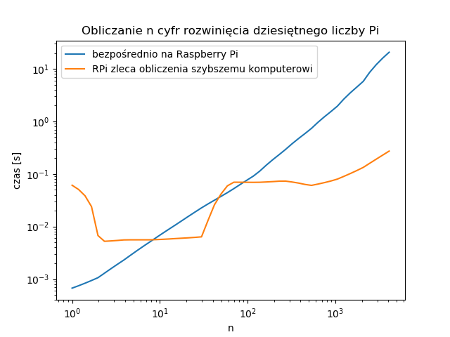

#### Przykłady metod i zastosowań komunikacji między urządzeniami w sieci

##### ze szczególnym uwzględnieniem połączenia ROBOT <-> PC


+++


+++

#### Python: dict (słownik)

```python
d = {
    'category': 'A+',
}

d['category'] = 'A'
d.update({'eres': False})

# Otrzymamy d = 
{
    'category': 'A',
    'eres': False
}
```

+++

#### Serializacja danych: problem

* chcemy wysłać `dict`, zakładamy że bezośrednio możemy wysłać tylko `str`

* chcemy odebrać `dict`, zakładamy że bezpośrednio odbieramy `str` 

+++

#### Serializacja danych: przykładowe rozwiązanie

* przed wysłaniem serializujemy `dict` do `str` używając `str()`

* po odebraniu deserializujemy `str` do `dict` używając `ast.literal_eval()`

+++

#### Struktura projektu

```text
ssh_com_rpi_demo
├── __init__.py
├── controller
│   ├── __init__.py
│   ├── pc.py
│   └── rpi.py
└── utilities.py
```

+++

```text
ssh_com_rpi_demo
├── __init__.py
├── controller
│   ├── __init__.py
│   ├── pc.py
│   └── rpi.py      <---
└── utilities.py
```

+++?code=assets/code/ssh_com_rpi_demo/controller/rpi.py&lang=python

@[1](literal_eval: str -> dict)
@[2](stdin: standardowe wejście)
@[3](Thread: wątek)

@[8](Klasa RPi)

@[53-60](Przykładowe wywołanie metody \_\_init\_\_)
@[9](Metoda \_\_init\_\_)
@[11-12](Przypisanie wartości polom)
@[14](Ustawienie stanu diod na wyłączone)
@[16-18](Konfiguracja GPIO)
@[19-29](Utworzenie wątków)

@[31](Metoda _process_input)
@[32](Wczytuj dane z stdin linia po linii)
@[33](Stwórz słownik na podstawie otrzymanej linii)
@[35-38](Jeśli otrzymano informacje na temat stanu diod, zaktualizuj go)

@[42](Metoda \_output_temperature)
@[43](Nieskończona pętla)    
@[44](Otwórz plik na potrzeby poniższego fragmentu kodu)
@[45-48](Odczytaj temperaturę i jeśli odczyt się powiódł, wyślij do stdout)
+++

```text
ssh_com_rpi_demo
├── __init__.py
├── controller
│   ├── __init__.py
│   ├── pc.py       <---
│   └── rpi.py
└── utilities.py
```

+++?code=assets/code/ssh_com_rpi_demo/controller/pc.py&lang=python

@[2](Popen: proces klienta ssh)
@[11](FixedSizeList.push(): wyrzuca najstarszy element, robi miejsce dla nowego)

@[74-85](Uruchamiamy klienta ssh)
@[14](Klasa PC)
@[15](Nazwy diod (kluczy w słowniku))
@[87-90](Przykładowe wywołanie metody \_\_init\_\_)
@[17](Metoda \_\_init\_\_)
@[18-19](Przypisanie wartości polom)
@[21-29](Utworzenie pól dotyczących wykresu)
@[31](Utworzenie GUI)
@[39](Metoda tworząca GUI)
@[33-37](Utworzenie wątku przetwarzającego stdin)
@[53-54](Wysyłanie polecenia zaświecenia lub zgaszenia diody jeśli zostanie zmieniony stan dowolnego przycisku)
@[56-63](Metoda _process_input)

+++


+++

```text
ssh_com_rpi_demo
├── __init__.py
├── controller
│   ├── __init__.py
│   ├── pc.py
│   └── rpi.py
├── processing
│   ├── __init__.py
│   ├── pc.py
│   └── rpi.py      <---
└── utilities.py
```

+++?code=assets/code/ssh_com_rpi_demo/processing/rpi.py&lang=python

@[3](timeit: mierzenie czasu wykonania fragmentu kodu)
@[5](pidigits(n): oblicza n cyfr rozwinięcia dziesiętnego liczby Pi)

@[8-11](Funkcja pidigits_remote zleca PC wykonanie pidigits)
@[10](Uwaga: w tym miejscu program czeka na wynik)

@[14-23](Opracuj i wyślij statystyki)

+++

```text
ssh_com_rpi_demo
├── __init__.py
├── controller
│   ├── __init__.py
│   ├── pc.py
│   └── rpi.py
├── processing
│   ├── __init__.py
│   ├── pc.py       <---
│   └── rpi.py
└── utilities.py
```

+++?code=assets/code/ssh_com_rpi_demo/processing/pc.py&lang=python

@[23-32](Metoda _process_input)

+++



+++

#### Inne sposoby komunikacji: socket (gniazdo)

W tym przypadku TCP

```bash
# serwer (PC)

nc -p 4242 -l 0.0.0.0 | mplayer -fps 40 -demuxer h264es -


# klient (RPi)

raspivid -fps 40 -o - | nc 192.168.123.100 #...
# lub
raspivid -o tcp://192.168.123.100:4242 -fps 40 #...
```

@[1,3](PC nasłuchuje na wszystkich intefejsach sieciowych na porcie 4242. To, co odbierze będzie na bieżąco przekaywane do odtwarzacza.)
@[6,8](raspivid przekazuje programowi netcat skompresowane wideo, netcat łączy się z serwerem i wysyła dane na bieżąco.)
@[6,9,10](raspivid może też wysyłać dane bezpośrednio)

+++

#### Inne sposoby komunikacji: socket (gniazdo)

Na podstawie **22** próbek ustaliłem, że średnia latencja wynosi **0.3 ± 0.1 s** (mediana **303 ms**)

```text
275
302
300
341
304
300
323
326
323
352
302
296
324
297
323
295
298
349
294
347
318
293
```

+++


+++

#### Dziękuję za uwagę

Tę prezentację można znaleźć pod adresem: [gitpitch.com/protecto/prezentacja-ssh-stdio](https://gitpitch.com/protecto/prezentacja-ssh-stdio)

Źródło obrazków: [raspberrypi.org/learning/hardware-guide/](https://www.raspberrypi.org/learning/hardware-guide/)
